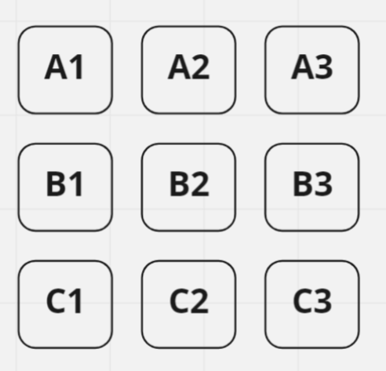

# Web Api для игры в Крестики Нолики

<h3>Описание</h3>
Api предоставляет возможность получить объект поля 3х3 с далнейшим изменением состояния его клеток и отчистки. А также Имеет всю логику по вычислению выигравшего.

<h3>Поле имеет следующий вид:</h3>

Каждая ячейка имеет свой уникальный ключ, по которому нужно к ней обращаться (<b>А1</b>, <b>А2</b> и т.д.)

<h3>Запросы к Api:</h3>
<table>
<tr>
<td><h4>GET</h4></td>
<td>/api/Feald</td>
<td>Возвращает Json объект поля с текущим состоянием всех ячеек</td>
</tr>
<tr>
<td><h4>POST</h4></td>
<td>/api/Feald?cellKey={key}&cellValue={value}</td>
<td>Задает значение конкретной ячейке и возвращает Json объект поля с текущим состоянием всех ячеек</td>
</tr>
<tr>
<td><h4>GET</h4></td>
<td>/api/continue</td>
<td>Возвращает Json объект поля с чистыми ячейками</td>
</tr>
</table>
Пример POST запроса:

POST: /api/Feald?cellKey=A1&cellValue=x

<h3>Передаваемые значения в запросе:</h3>
<table>
<tr>
<td>{key}</td>
<td>Уникальный ключ ячейки (А1, А2 ..., С3 - см. рисунок выше)</td>
</tr>
<tr>
<td>{value}</td>
<td>Передача значения от игрока. Буква 'x' или 'o'</td>
</tr>
</table>

<h3>Пример ответа с сервера:</h3>
<blockquote>
<pre>
<code>
{
  "gameStatus": "Draw",
  "currentFealdJson": {
    "FealdArray": [
      [
        {
          "Key": "A1",
          "Value": "x",
          "IsAble": false
        },
        {
          "Key": "A2",
          "Value": "",
          "IsAble": true
        },
        {
          "Key": "A3",
          "Value": "",
          "IsAble": true
        }
      ],
      [
        {
          "Key": "B1",
          "Value": "",
          "IsAble": true
        },
        {
          "Key": "B2",
          "Value": "",
          "IsAble": true
        },
        {
          "Key": "B3",
          "Value": "",
          "IsAble": true
        }
      ],
      [
        {
          "Key": "C1",
          "Value": "",
          "IsAble": true
        },
        {
          "Key": "C2",
          "Value": "",
          "IsAble": true
        },
        {
          "Key": "C3",
          "Value": "",
          "IsAble": true
        }
      ]
    ]
  }
}
</code>
</re>
</blockquote>

В ответе с сервера так есть поле <b>gameStatus</b>. Его значение может быть: 
<table>
<tr>
<td>Drow</td>
<td>Ничья - можно продолжать игру</td>
</tr>
<tr>
<td>СrossWin</td>
<td>Победил игрок, игравший за Крестики</td>
</tr>
<tr>
<td>СircleWin</td>
<td>Победил игрок, игравший за Нолики</td>
</tr>
</table>
